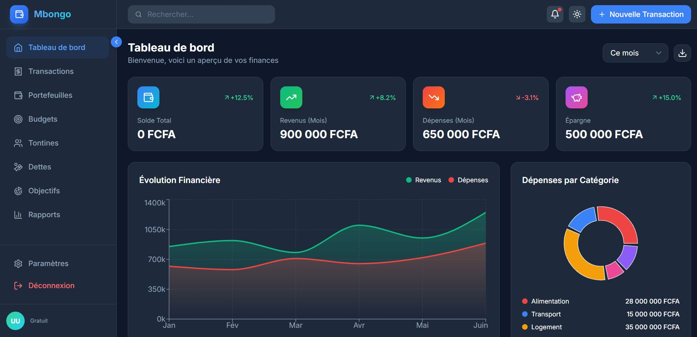

# Mbongo Web - Application de Gestion Financière

Application web Next.js pour la gestion financière personnelle et d'entreprise, conçue pour le marché congolais.



## 🚀 Fonctionnalités

- **Tableau de bord** - Vue d'ensemble de vos finances avec graphiques interactifs
- **Transactions** - Suivi complet des revenus et dépenses
- **Portefeuilles** - Gestion multi-comptes (Cash, MTN MoMo, Banque, etc.)
- **Budgets** - Définition et suivi des budgets par catégorie
- **Tontines** - Gestion des groupes d'épargne traditionnels
- **Dettes** - Suivi des prêts et emprunts
- **Objectifs** - Épargne vers des objectifs spécifiques
- **Rapports** - Analyses détaillées avec graphiques

## 📋 Prérequis

- Node.js 18+ 
- npm ou yarn
- Backend API Go (Mbongo API) fonctionnel

## 🛠️ Installation

### 1. Cloner/Copier le projet

```bash
# Copier le dossier mbongo-web dans votre espace de travail
cd mbongo-web
```

### 2. Installer les dépendances

```bash
npm install
# ou
yarn install
```

### 3. Configurer l'environnement

```bash
# Copier le fichier d'exemple
cp .env.example .env.local

# Modifier l'URL de l'API
nano .env.local
```

Contenu de `.env.local`:
```env
API_URL=http://localhost:8080/api/v1
```

### 4. Lancer le serveur de développement

```bash
npm run dev
# ou
yarn dev
```

L'application sera accessible sur [http://localhost:3000](http://localhost:3000)

## 📁 Structure du Projet

```
mbongo-web/
├── app/                    # Pages Next.js (App Router)
│   ├── auth/              # Pages d'authentification
│   │   ├── login/
│   │   └── register/
│   ├── dashboard/         # Tableau de bord
│   ├── transactions/      # Gestion transactions
│   ├── wallets/           # Portefeuilles
│   ├── budgets/           # Budgets
│   ├── tontines/          # Tontines
│   ├── debts/             # Dettes
│   ├── goals/             # Objectifs
│   └── reports/           # Rapports
├── components/            # Composants React
│   ├── layout/           # Sidebar, Header
│   ├── modals/           # Modales
│   └── ui/               # Composants UI
├── contexts/              # Contextes React
│   ├── AuthContext.tsx   # Authentification
│   └── ThemeContext.tsx  # Thème dark/light
├── lib/                   # Utilitaires
│   ├── api.ts            # Service API Axios
│   └── utils.ts          # Fonctions helpers
├── types/                 # Types TypeScript
└── public/               # Assets statiques
```

## 🔌 Connexion à l'API Backend

L'application se connecte à votre API Go Mbongo. Assurez-vous que:

1. Le backend est lancé sur `http://localhost:8080`
2. Les endpoints suivants sont disponibles:
   - `POST /api/v1/auth/login`
   - `POST /api/v1/auth/register`
   - `POST /api/v1/auth/refresh`
   - `GET /api/v1/wallets`
   - `GET /api/v1/transactions`
   - `GET /api/v1/budgets`
   - `GET /api/v1/tontines`
   - `GET /api/v1/debts`
   - `GET /api/v1/goals`
   - `GET /api/v1/categories`

### Configuration CORS Backend

Dans votre fichier Go `main.go`:

```go
import "github.com/rs/cors"

c := cors.New(cors.Options{
    AllowedOrigins:   []string{"http://localhost:3000"},
    AllowedMethods:   []string{"GET", "POST", "PUT", "DELETE", "OPTIONS"},
    AllowedHeaders:   []string{"Authorization", "Content-Type"},
    AllowCredentials: true,
})
```

## 🎨 Personnalisation

### Thème

L'application supporte les thèmes dark et light. Modifiez les couleurs dans `tailwind.config.js`:

```javascript
theme: {
  extend: {
    colors: {
      primary: {
        500: '#3b82f6', // Couleur principale
      },
    },
  },
}
```

### Devise

Pour changer la devise (FCFA par défaut), modifiez `lib/utils.ts`:

```typescript
export function formatMoney(amount: number, fromCentimes: boolean = true): string {
  // Changez 'FCFA' par votre devise
  return `${formatted} FCFA`;
}
```

## 🚀 Déploiement Production

### Build

```bash
npm run build
npm run start
```

### Vercel (Recommandé)

```bash
npm install -g vercel
vercel
```

### Docker

```dockerfile
FROM node:18-alpine
WORKDIR /app
COPY package*.json ./
RUN npm ci --only=production
COPY . .
RUN npm run build
EXPOSE 3000
CMD ["npm", "start"]
```

## 🔧 Scripts Disponibles

| Commande | Description |
|----------|-------------|
| `npm run dev` | Serveur de développement |
| `npm run build` | Build de production |
| `npm run start` | Démarrer en production |
| `npm run lint` | Vérifier le code |

## 📱 Compatibilité

- ✅ Desktop (Chrome, Firefox, Safari, Edge)
- ✅ Tablette (iPad, Android)
- ✅ Mobile (iOS, Android)
- ✅ PWA Ready

## 🛡️ Sécurité

- Tokens JWT stockés dans les cookies HttpOnly
- Refresh token automatique
- Protection CSRF
- Validation des entrées

## 📞 Support

Pour toute question ou problème:
- Créez une issue sur GitHub
- Contactez le développeur

## 📄 Licence

MIT License - Voir fichier LICENSE

---

Développé avec ❤️ pour le Congo 🇨🇬
